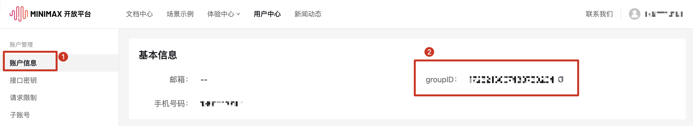
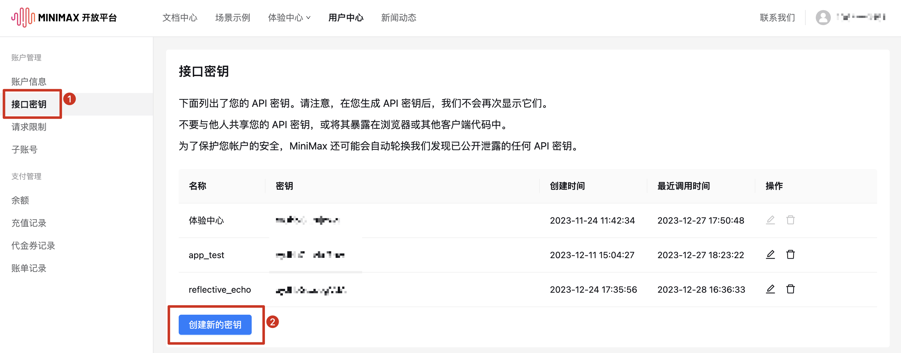
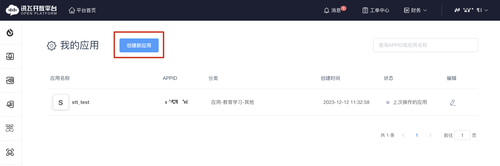
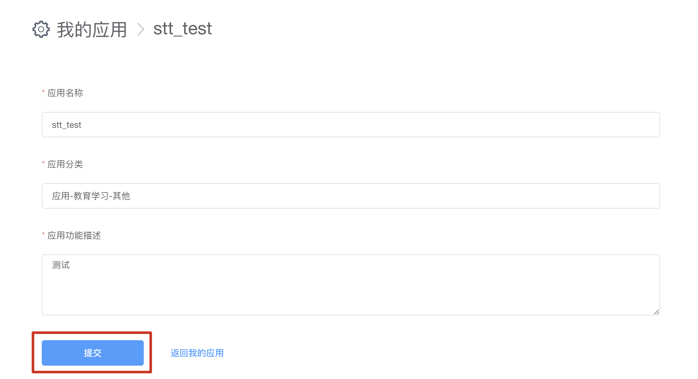
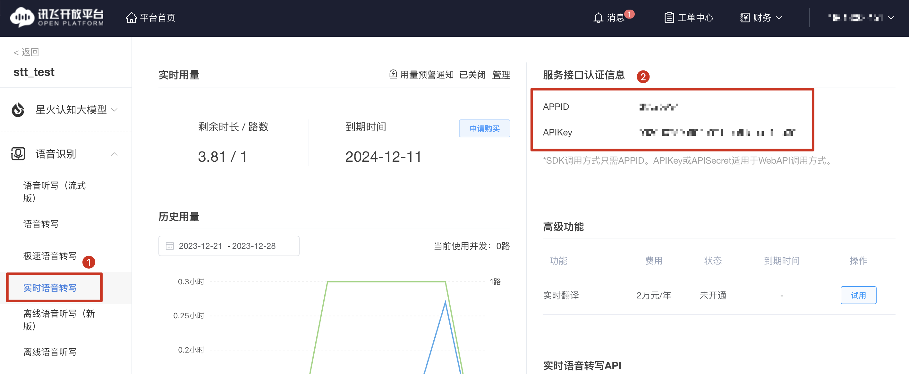

# Quick Start

1. 如果 RefelctiveEcho.app 无法运行，建议下载源码，运行 `main.py`，进入程序
2. 点击左上角菜单栏「设置」，填写设置信息，所有信息需要填写完毕才能开始使用程序
3. 点击「开始复盘」按钮
4. 选择语音输入，点击「🎙️」按钮，程序会自动将语音信息转换成文字信息，输入到文本框。停止说话3秒后，程序停止录音。你可以多次点击「🎙️」进行语音输入，当你认为可以提交信息时，点击「⌨️」按钮，提交信息
5. 选择文本输入，直接在文本框输入内容，然后点击「⌨️」按钮，提交信息
6. 点击「结束复盘」，程序将保存你和Echo的对话记录，并开始制作复盘报告
7. 复盘的对话记录和报告文档，会以markdown格式，保存在你设置的文档保存路径

## 注意事项

- MiniMax API，在未充值前会有响应限制，无法连续对话，可以考虑充值1-5元试用。正在调试其他语音模型，如果不想在试用阶段花费，请等待之后更新模型再使用 :D

## API Keys 获取

### MiniMax

[MiniMax 开放平台](https://api.minimax.chat/)

1. 注册并登陆账号后，点击右上角个人账号，进入[用户中心](https://api.minimax.chat/user-center/basic-information)

2. 点击`账户信息`，在`基本信息`中找到 groupID

    

3. 点击`接口密钥`，点击`创建新的密钥`，获取 apikey。使用前需要小额充值，详细见注意事项。

    

### 讯飞

[讯飞开放平台](https://www.xfyun.cn/)

1. 注册并登陆账号后，进入[控制台](https://console.xfyun.cn/app/myapp)

2. 点击`创建新应用`，根据需求填写信息并提交

    
    

3. 创建应用后在左侧栏选择`实时语音转写`，右上角为 `appid` 和 `apikey`。使用前需要领取免费试用包。

    